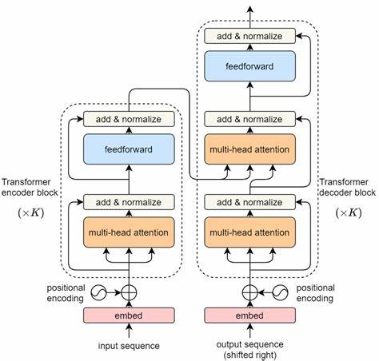
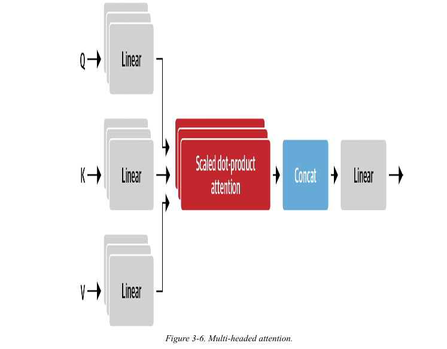
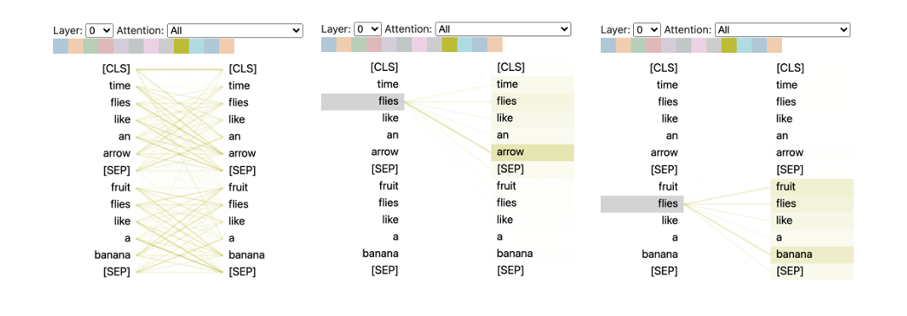

# Transformer Anatomy - Building a Transformer from Scratch

This repository contains the implementation and code examples from Chapter 3 of the book *NLP with Transformers* titled **"Transformer Anatomy."** In this chapter, we build a Transformer from scratch, diving deep into its components: **Encoder**, **Decoder**, and **Multi-head Attention**. We also visualize the learning process of Transformers using **BertViz**.

## Overview

In this repository, we implement a Transformer model from scratch to understand its architecture and inner workings. The Transformer architecture revolutionized NLP by introducing self-attention mechanisms and a more parallelized way of processing data compared to traditional RNNs.

This chapter focuses on the following key components:
- **Encoder and Decoder:** The backbone of the Transformer.

- **Multi-head Attention:** The mechanism that enables Transformers to focus on different parts of the input.

- **BertViz:** A tool to visualize how Transformers learn to attend to different parts of a sentence.

